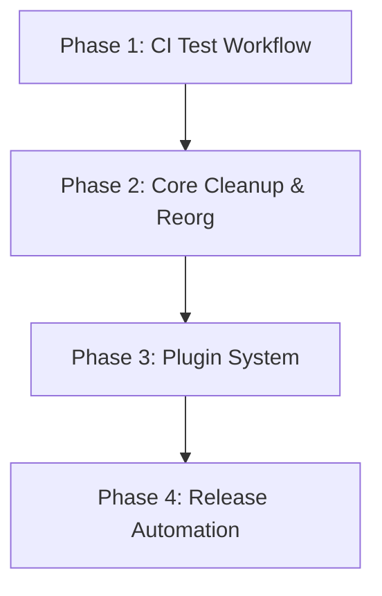

# Master Refactoring & Implementation Plan

Single source of truth for a multi-phase refactor/build-out of `<project>`. This is a
**global template** — it demonstrates the *format* an executor agent should produce and
live-update, not literal content to copy. Replace phases, file links, and rationale with
whatever the real project needs; keep the shape: `## Progress` first, a roadmap, explicit
cross-cutting rules, then one detailed section per phase.

## Progress

- [x] **Phase 1: CI Test Workflow** — done. `.github/workflows/test.yaml` added
  (`workflow_dispatch` w/ `ref` input + `ci-*` tag push trigger). Validated via a
  throwaway `ci-phase1` tag — all matrix jobs green; tag deleted after per the documented
  cleanup step.
- [x] **Phase 2: Core Cleanup & Reorganization** — done, 142 tests passing.
  - `WidgetRegistry` result contract codified on its docstring + root `AGENTS.md`;
    `LegacyLoader` now raises `KeyError` for an unconfigured key instead of silently
    returning a default (deviation from the original plan — was going to return `None`,
    changed after finding a caller that couldn't distinguish "unset" from "explicitly
    none").
  - `CHANGELOG.md` `[Unreleased]` updated for all of the above.
- [/] **Phase 3: Plugin System** — in progress. Loader + discovery done; sandboxing not
  started.
- [ ] **Phase 4: Release Automation** — not started, blocked on Phase 3.

**Release context**: Executes pre-1.0.0; breaking changes are allowed. **Never push a
`v*` tag during execution** — if PyPI Trusted Publishing is live, version strings are
permanently consumed. `ci-*` tags are always safe to push and delete freely.

---

## 1. Roadmap & Phases

---

## 2. Cross-Cutting Rules (apply to every phase)

- **Result contract**: state the invariant every implementation must follow (e.g. "a
  lookup raises `KeyError` for *no opinion*, never a sentinel value") and *audit every
  existing implementation* for compliance, not just new code. Document the contract in
  the relevant docstring, `AGENTS.md`'s architecture section, and `docs/`.
  * *Why*: downstream composition (chaining, fallback, caching) only works if every
    implementor actually follows the contract — say why in one line so a future reader
    doesn't have to rediscover it.
- **Caches must be test-isolatable**: every new cache needs a `clear()`/bypass seam and
  an autouse-fixture note in the relevant test file. Never a bare `functools.lru_cache`
  over something a test monkeypatches — a cross-test cache silently poisons later tests.
- **Collateral updates each phase**: tests, `docs/api/*.md` (if using mkdocstrings —
  `mkdocs build --strict` should gate the release workflow so a stale module path fails
  loudly), README feature/API table, `CHANGELOG.md` `[Unreleased]`, root `AGENTS.md`.
- **Verification**: name the actual local test command (e.g.
  `.venv/<version>/bin/pytest`) and which platform-specific paths need real CI instead
  of local mocking.

---

## 3. Phase 1: CI Test Workflow (do first — later phases need it) — ✅ DONE

- New `.github/workflows/test.yaml`, separate from `release.yaml`'s release-gate test
  job: triggers = `workflow_dispatch` (with a `ref` input) **+** push of tags matching
  `ci-*` (must not overlap the `v*` release trigger). Add a `concurrency` group so
  superseded runs cancel.
- Matrix: mirror `release.yaml`'s test job (OS × supported Python versions).
- **Agent usage** (document in root `AGENTS.md`): push a throwaway tag
  (`git tag ci-<topic> && git push origin ci-<topic>`, delete after), or
  `gh workflow run test.yaml --ref <branch>`. Check results via `gh run list`/`view`.
  * *Why*: lets an agent validate platform-specific code without dashboard access, and
    without ever touching the real release trigger.

---

## 4. Phase 2: Core Cleanup & Reorganization — ✅ DONE

- **[Whatever the actual refactor is]**: name the specific file(s)
  (`path/to/module.py:42`), the specific change, and *why* — a past
  bug it fixes, an inconsistency it removes, a coupling it breaks.
  * *Why*: this is the line a future executor reads instead of re-deriving your
    reasoning from the diff.
- **Folder reorganization** (if applicable): keep old import paths working via
  re-exports unless the project has explicitly accepted a breaking move (state which,
  and why); update every doc/test reference in the same phase, not a follow-up.

---

## 5. Phase 3: Plugin System — 🔄 IN PROGRESS (see Progress above)

- Break the phase into the same shape as the others once it's underway: what's the
  target design, what file(s) does it land in, what's the highest-risk/most-complex
  piece worth flagging explicitly (mark it, e.g., "**highest-complexity item in this
  plan**" the way Phase 3 items often deserve extra scrutiny before merging).

---

## 6. Phase 4: Release Automation — not started

- **Changelog scraper** in `release.yaml`: extract the pushed tag's `## [x.y.z]` section
  out of `CHANGELOG.md` into `release_notes.md`, fed to the GitHub release action via
  `body_path`. Keep `generate_release_notes: true` alongside it — most release actions
  append their own compare-link line after the provided body rather than replacing it.
  * *Why*: a repo without a PR-based workflow gets a thin/empty auto-generated "What's
    Changed" on every release, not just the first — the changelog is the real notes.

---

## 7. Completion / Release Handoff

- Fold `CHANGELOG.md`'s `[Unreleased]` section into the new `## [x.y.z] - <date>`
  heading (keep an empty `[Unreleased]` placeholder above it); bump `pyproject.toml`'s
  `version` (PEP 440 syntax) in the same commit; update root `AGENTS.md`'s architecture
  notes for anything the phases above changed.
- Explicitly record what's genuinely **unverified** at handoff (e.g. "the release
  workflow's end-to-end run has not been observed — only dry-run-able by pushing a real
  `v*` tag, which is off-limits during execution") instead of implying full coverage.
- **Tagging `v*` requires the user's explicit, per-release consent** if PyPI/publish
  automation is live — finish everything else first so tagging is the only remaining
  step, then ask. A yes for one release is not standing consent for the next.
